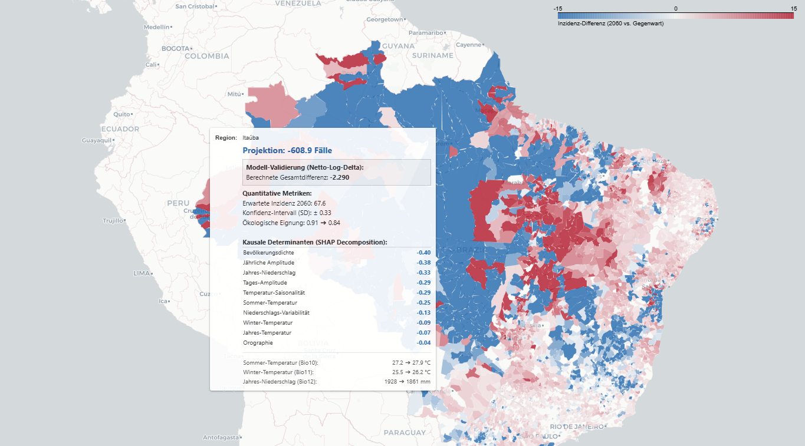
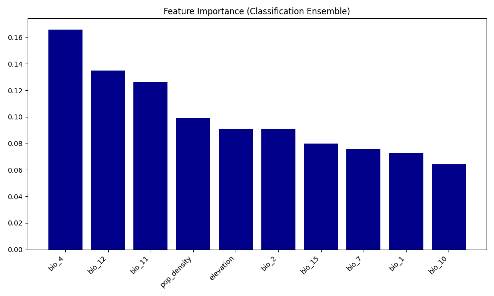

# Modeling Cutaneous Leishmaniasis: Climate Change & Epidemiology (Brazil)



## Project Overview
This project establishes an "End-to-End" pipeline to model the impact of climate change (Scenario **SSP3-7.0**) on the incidence of Cutaneous Leishmaniasis in Brazil. By fusing epidemiological data, demographic statistics, and bioclimatic variables, we predict risk shifts for the period **2041–2060**.

### Data Sources
* **Health (Response):** DATASUS / SINAN (Reported cases)
* **Demographics:** IBGE (Population estimates for incidence calculation)
* **Climate (Predictors):** WorldClim (Historical data & CMIP6 Projections)
* **Geometry:** GADM Level 2 (Brazilian Municipalities)

### Key Features
* **Source-Agnostic:** The Python code is adaptable for other regions (e.g., North Africa) by swapping shapefiles and health registers.
* **Machine Learning Ensemble:** Utilizes a Voting Regressor combining **XGBoost**, **Random Forest**, and **Ridge Regression**.
* **Explainable AI:** Integration of **SHAP values** to decode local risk drivers (e.g., identifying if heat or humidity drives the risk).
* **Interactive Dashboard:** HTML-based visualization of incidence projections and causal analysis.

---

## Repository Structure

The core logic is located in the `src/` folder, designed as a sequential pipeline:

* `01_climate_prep.py` - Processing and aggregating WorldClim raster data using zonal statistics.
* `02_build_dataset.py` - Merging health data, demographics, and climate predictors.
* `03_add_demographics.py` - Calculating normalized incidence rates (Cases per 100k).
* `06_train_model.py` - Training and evaluating the Voting Regressor Ensemble.
* `09_response_curves.py` - Analyzing ecological dependencies (PDPs/ALE).
* `10_final_dashboard.py` - Generating the interactive HTML visualization.

---

## Key Results

### 1. Feature Importance
The classification model identified **Temperature Seasonality (`bio_4`)** and **Annual Precipitation (`bio_12`)** as the primary drivers for defining risk areas. Stability is key for the vector's survival.



### 2. Future Projection (SSP3-7.0)
The projection for 2041–2060 reveals distinct ecological shifts rather than a universal increase:
* **Amazon Recovery:** Surprisingly, parts of the Amazon show a **decline** in incidence. The model attributes this to **thermal stress**, where rising temperatures (>30°C) exceed the physiological survival limit of the sandfly vector (desiccation of larvae).
* **Coastal Stability:** The coastal belt remains relatively stable. The model suggests that strong **ocean winds**, the cooling effect of the sea, and high degrees of **surface sealing (concrete/urbanization)** act as natural barriers against vector proliferation.

### 3. Explainable AI & Actionable Insights
Using SHAP values, we move beyond simple prediction to specific prevention strategies:
* **Targeted Intervention:** The model identifies *why* a region is at risk.
* **Example - Rain & Hygiene:** In areas driven by precipitation (`bio_12`), the risk often correlates with waterlogged organic waste. Instead of broad spraying, local authorities can focus on **waste management** and removing wet biomass breeding grounds.

---

## Usage

### 1. Install Dependencies
Ensure you have Python installed:
```bash
pip install -r requirements.txt
```

### 2. Run the Pipeline
Execute the scripts sequentially from the `src/` folder:
```bash
python src/01_climate_prep.py
python src/02_build_dataset.py
# ... run scripts 03 to 09 ...
python src/10_final_dashboard.py
```


